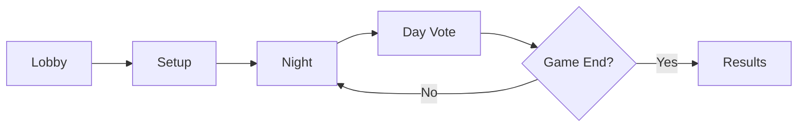

# 🐺 Werewolf - Blockchain Social Deduction Game

<div align="center">


**A fully decentralized implementation of the classic Werewolf (Mafia) game on the blockchain**

[](https://opensource.org/licenses/MIT)
[](https://soliditylang.org/)
[](https://nextjs.org/)
[](https://www.typescriptlang.org/)

[Features](#-features) • [Quick Start](#-quick-start) • [Game Rules](#-game-rules) • [Architecture](#-architecture)

</div>

---

## 📖 Overview

**Werewolf** is a blockchain-based social deduction game protocol that brings the classic party game to the decentralized world. Players interact through smart contracts, ensuring transparency, fairness, and verifiability while maintaining strategic gameplay through commit-reveal schemes.

### 🎭 Supported Roles

| Role | Icon | Faction | Ability |
|------|------|---------|---------|
| **Villager** | 👤 | Good | No special ability |
| **Werewolf** | 🐺 | Evil | Vote to eliminate a player each night |
| **Seer** | 🔮 | Good | Check one player's identity per night |
| **Witch** | 🧪 | Good | One-time save and one-time poison |
| **Hunter** | 🏹 | Good | Shoot another player when eliminated |

---

## ✨ Features

- 🔐 **Fully On-Chain**: All game logic and state managed by smart contracts
- 🎲 **Fair Randomness**: Secure role assignment using blockchain randomness
- 🔒 **Commit-Reveal Scheme**: Strategic actions remain secret until reveal phase
- 💰 **Stake-Based**: Optional stakes to ensure serious gameplay
- ⏱️ **Timed Phases**: Automatic progression with configurable deadlines
- 🎨 **Modern UI**: Beautiful Next.js frontend with React components
- 🌐 **Cross-Platform**: Works on any device with a Web3 wallet

---

## 🏗️ Architecture

```
Werewolf/
├── contracts/              # Solidity smart contracts
│   ├── Werewolf.sol       # Main game contract
│   └── scenario.json      # Game configuration
├── scripts/               # Deployment scripts
│   ├── deploy_with_ethers.ts
│   ├── deploy_with_web3.ts
│   └── *-lib.ts
├── frontend/              # Next.js web application
│   ├── src/
│   │   ├── app/          # App router pages
│   │   ├── components/   # React components
│   │   └── lib/          # Web3 integration
│   └── public/
│       └── images/       # Game assets
├── figures/              # Role artwork (backup)
└── artifacts/            # Compiled contracts (gitignored)
```

---

## 🚀 Quick Start

### Prerequisites

- **Node.js** 18+ and npm/yarn
- **MetaMask** or any Web3 wallet
- **Remix IDE** (for smart contract deployment)

### 1️⃣ Clone the Repository

```bash
git clone https://github.com/yourusername/Werewolf.git
cd Werewolf
```

### 2️⃣ Deploy Smart Contracts

**Option A: Using Remix IDE (Recommended)**

1. Open [Remix IDE](https://remix.ethereum.org/)
2. Import the `contracts/Werewolf.sol` file
3. Compile with Solidity ^0.8.24
4. Deploy to your preferred network (testnet recommended)
5. Copy the contract address

**Option B: Using Deployment Scripts**

```bash
# Using Ethers.js
npx ts-node scripts/deploy_with_ethers.ts

# Using Web3.js
npx ts-node scripts/deploy_with_web3.ts
```

### 3️⃣ Setup Frontend

```bash
# Navigate to frontend directory
cd frontend

# Install dependencies
npm install

# Configure environment (create .env.local)
echo "NEXT_PUBLIC_CONTRACT_ADDRESS=your_contract_address" > .env.local
echo "NEXT_PUBLIC_CHAIN_ID=your_chain_id" >> .env.local

# Start development server
npm run dev
```

### 4️⃣ Open in Browser

Visit [http://localhost:3000](http://localhost:3000) and connect your Web3 wallet!

---

## 🎮 Game Rules

### 📋 Game Flow



### 🌙 Night Phase

1. **Werewolves** secretly vote to eliminate a villager
2. **Seer** checks one player's identity
3. **Witch** can use save or poison potion (once each)

### ☀️ Day Phase

1. Night results are revealed
2. Players discuss and debate
3. Vote to eliminate a suspected werewolf
4. **Hunter** shoots if eliminated

### 🏆 Victory Conditions

- **Good Wins**: All werewolves eliminated
- **Evil Wins**: Werewolves equal or outnumber good players

---

## 🛠️ Technology Stack

### Smart Contracts
- **Solidity** ^0.8.24
- **Hardhat/Remix** for development and testing
- **Ethers.js** / **Web3.js** for deployment

### Frontend
- **Next.js** 16.0.1 with App Router
- **React** 19.2.0
- **TypeScript** 5.0
- **Tailwind CSS** 4.1
- **Ethers.js** 6.15 for Web3 integration
- **Zustand** for state management

---

## 🔧 Development

### Project Structure

```typescript
// Smart Contract Phases
enum Phase { 
    Lobby, Setup, 
    NightCommit, NightReveal, NightResolve, NightWitch, 
    DayVote, HunterShot, 
    Ended 
}

// Available Roles
enum Role { Villager, Wolf, Seer, Hunter, Witch }
```

### Key Components

- **GameHeader.tsx** - Game status and player info display
- **JoinWerewolfGame.tsx** - Lobby and game creation
- **PlayerNight.tsx** - Night phase actions (Werewolf, Seer)
- **PlayerDay.tsx** - Day phase voting
- **PlayerHunter.tsx** - Hunter's final shot
- **PlayerEnd.tsx** - Game results

### Frontend Development

```bash
cd frontend

# Run development server
npm run dev

# Build for production
npm run build

# Start production server
npm start

# Run linter
npm run lint
```

### Smart Contract Development

```bash
# Compile contracts in Remix IDE
# Or use Hardhat if configured

# Test deployment on testnet first
# Recommended: Sepolia, Goerli, or Mumbai
```

---

## 🎨 Game Configuration

Customize game parameters in the smart contract:

```solidity
GameConfig {
    uint8   minPlayers;     // Minimum players to start
    uint8   maxPlayers;     // Maximum lobby capacity
    uint8   wolves;         // Number of werewolves
    uint256 stake;          // Required stake per player (in wei)
    uint32  tSetup;         // Setup phase duration
    uint32  tNightCommit;   // Night commit duration
    uint32  tNightReveal;   // Night reveal duration
    uint32  tDayVote;       // Day vote duration
}
```

---

## 📄 License

This project is licensed under the **MIT License** - see the [LICENSE](LICENSE) file for details.

---

<div align="center">

**Built as part of the NUS Blockchain Engineering course**

🐺 Made with blockchain technology

</div>
