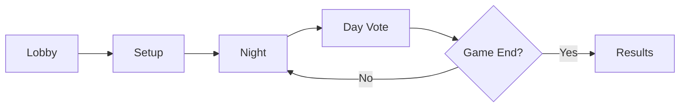

# 🐺 Werewolf - Blockchain Social Deduction Game

<div align="center">


**A fully decentralized implementation of the classic Werewolf (Mafia) game on the blockchain**

[](https://opensource.org/licenses/MIT)
[](https://soliditylang.org/)
[](https://nextjs.org/)
[](https://www.typescriptlang.org/)

[Features](#-features) • [Quick Start](#-quick-start) • [Game Rules](#-game-rules) • [Architecture](#-architecture)

</div>

---

## 📖 Overview

**Werewolf** is a blockchain-based social deduction game protocol that brings the classic party game to the decentralized world. Players interact through smart contracts, ensuring transparency, fairness, and verifiability while maintaining strategic gameplay through commit-reveal schemes.

### 🎭 Supported Roles

| Role | Icon | Faction | Ability |
|------|------|---------|---------|
| **Villager** | 👤 | Good | No special ability |
| **Werewolf** | 🐺 | Evil | Vote to eliminate a player each night |
| **Seer** | 🔮 | Good | Check one player's identity per night |
| **Witch** | 🧪 | Good | One-time save and one-time poison |
| **Hunter** | 🏹 | Good | Shoot another player when eliminated |

---

## ✨ Features

- 🔐 **Fully On-Chain**: All game logic and state managed by smart contracts
- 🎲 **Fair Randomness**: Secure role assignment using blockchain randomness
- 🔒 **Commit-Reveal Scheme**: Strategic actions remain secret until reveal phase
- 💰 **Stake-Based**: Optional stakes to ensure serious gameplay
- ⏱️ **Timed Phases**: Automatic progression with configurable deadlines
- 🎨 **Modern UI**: Beautiful Next.js frontend with React components
- 🌐 **Cross-Platform**: Works on any device with a Web3 wallet
- 🎮 **Host/Player Separation**: Dedicated interfaces for game hosts and players
- 🎭 **Role Visualization**: Visual role cards with character images
- 🏆 **Victory/Defeat Screens**: Stunning end-game animations based on game outcome
- 📊 **Vote Tracking**: Real-time vote tally with tie detection and visual indicators
- 🔄 **Game Restart**: Host can restart games without losing players
- 📱 **Persistent Game State**: Game addresses saved to localStorage for easy reconnection

---

## 🏗️ Architecture

```
Werewolf/
├── contracts/              # Solidity smart contracts
│   ├── Werewolf.sol       # Main game contract
│   └── scenario.json      # Game configuration
├── scripts/               # Deployment scripts
│   ├── deploy_with_ethers.ts
│   ├── deploy_with_web3.ts
│   └── *-lib.ts
├── frontend/              # Next.js web application
│   ├── src/
│   │   ├── app/          # App router pages
│   │   │   ├── page.tsx  # Homepage (Host/Player selection)
│   │   │   ├── host/     # Host dashboard
│   │   │   └── player/   # Player dashboard
│   │   ├── components/   # React components
│   │   │   ├── GameHeader.tsx
│   │   │   ├── PlayerList.tsx
│   │   │   ├── PlayerSeatTable.tsx
│   │   │   ├── PlayerNight.tsx
│   │   │   ├── PlayerDay.tsx
│   │   │   ├── PlayerHunter.tsx
│   │   │   ├── PlayerEnd.tsx
│   │   │   ├── HostControl.tsx
│   │   │   └── VoteTally.tsx
│   │   ├── contexts/    # React Context
│   │   │   └── WalletContext.tsx
│   │   └── lib/          # Web3 integration
│   │       ├── gameAbi.ts
│   │       ├── roleImages.ts
│   │       └── ethersHelpers.ts
│   └── public/
│       └── images/
│           └── roles/    # Role character images
│               ├── Villager.png
│               ├── Werewolf.png
│               ├── Seer.png
│               ├── Hunter.png
│               └── Witch.png
├── figures/              # Role artwork (backup)
└── artifacts/            # Compiled contracts (gitignored)
```

---

## 🚀 Quick Start

### Prerequisites

- **Node.js** 18+ and npm/yarn
- **MetaMask** or any Web3 wallet
- **Remix IDE** (for smart contract deployment)

### 1️⃣ Clone the Repository

```bash
git clone https://github.com/yourusername/Werewolf.git
cd Werewolf
```

### 2️⃣ Deploy Smart Contracts

**Option A: Using Remix IDE (Recommended)**

1. Open [Remix IDE](https://remix.ethereum.org/)
2. Import the `contracts/Werewolf.sol` file
3. Compile with Solidity ^0.8.24
4. Deploy the **WerewolfFactory** contract first
5. Use the factory to create game instances
6. Copy the factory address for the frontend

**Option B: Using Deployment Scripts**

```bash
# Using Ethers.js
npx ts-node scripts/deploy_with_ethers.ts

# Using Web3.js
npx ts-node scripts/deploy_with_web3.ts
```

### 3️⃣ Setup Frontend

```bash
# Navigate to frontend directory
cd frontend

# Install dependencies
npm install

# Start development server
npm run dev
```

**Note**: The frontend uses a global wallet connection system. Connect your MetaMask wallet on the homepage, then choose to be a Host or Player. Game addresses are automatically saved to localStorage for easy reconnection.

### 4️⃣ Open in Browser

Visit [http://localhost:3000](http://localhost:3000) and connect your Web3 wallet!

**Game Flow**:
1. **Homepage**: Connect wallet and choose Host or Player mode
2. **Host**: Create game using Factory, assign roles, and manage game phases
3. **Player**: Join game by entering game address, view your role, and perform actions
4. **Game End**: See victory/defeat screen with role reveal and statistics

---

## 🎮 Game Rules

### 📋 Game Flow



### 🌙 Night Phase

1. **Werewolves** secretly vote to eliminate a villager
2. **Seer** checks one player's identity
3. **Witch** can use save or poison potion (once each)

### ☀️ Day Phase

1. Night results are revealed
2. Players discuss and debate
3. Vote to eliminate a suspected werewolf
4. **Tie Detection**: If multiple players have the same highest vote count, no execution occurs
5. **Hunter** shoots if eliminated during voting

### 🏆 Victory Conditions

- **Good Wins**: All werewolves eliminated
- **Evil Wins**: Werewolves equal or outnumber good players

### 🎯 Game Management

- **Host Controls**: Create games, assign roles, advance phases, restart games
- **Player Actions**: Join games, perform role-specific actions, vote
- **Game Restart**: Host can restart a finished game without losing players
- **Persistent State**: Game addresses saved to localStorage for easy reconnection

---

## 🛠️ Technology Stack

### Smart Contracts
- **Solidity** ^0.8.24
- **Hardhat/Remix** for development and testing
- **Ethers.js** / **Web3.js** for deployment

### Frontend
- **Next.js** 16.0.1 with App Router
- **React** 19.2.0
- **TypeScript** 5.0
- **Tailwind CSS** 4.1
- **Ethers.js** 6.15 for Web3 integration
- **React Context** for global wallet state management
- **Next.js Image** for optimized role image display

---

## 🔧 Development

### Project Structure

```typescript
// Smart Contract Phases
enum Phase { 
    Lobby, Setup, 
    NightCommit, NightReveal, NightResolve, NightWitch, 
    DayVote, HunterShot, 
    Ended 
}

// Available Roles
enum Role { Villager, Wolf, Seer, Hunter, Witch }
```

### Key Components

#### Pages
- **page.tsx** (Home) - Landing page with wallet connection and Host/Player selection
- **host/page.tsx** - Host dashboard for game creation and management
- **player/page.tsx** - Player dashboard for joining and playing games

#### Game Components
- **GameHeader.tsx** - Game status and configuration display
- **PlayerList.tsx** - Host view of all players with roles and status
- **PlayerSeatTable.tsx** - Player view of seat table with role visibility
- **PlayerNight.tsx** - Night phase actions (Werewolf, Seer, Witch) with role card display
- **PlayerDay.tsx** - Day phase voting with tie detection and visual indicators
- **PlayerHunter.tsx** - Hunter's final shot interface
- **PlayerEnd.tsx** - Victory/Defeat screens with animations and final game results
- **HostControl.tsx** - Host controls for phase progression, role assignment, and game restart
- **VoteTally.tsx** - Real-time vote statistics display for hosts with tie detection

#### Infrastructure
- **WalletContext.tsx** - Global wallet state management
- **providers.tsx** - React Context providers wrapper
- **gameAbi.ts** - Contract ABI and constants (GAME_ABI, FACTORY_ABI, PHASE_NAMES, ROLE_NAMES)
- **roleImages.ts** - Role image mapping utilities
- **ethersHelpers.ts** - Ethers.js helper functions

### Frontend Development

```bash
cd frontend

# Run development server
npm run dev

# Build for production
npm run build

# Start production server
npm start

# Run linter
npm run lint
```

### Smart Contract Development

```bash
# Compile contracts in Remix IDE
# Or use Hardhat if configured

# Test deployment on testnet first
# Recommended: Sepolia, Goerli, or Mumbai
```

---

## 🎨 Game Configuration

Customize game parameters in the smart contract:

```solidity
GameConfig {
    uint8   minPlayers;     // Minimum players to start
    uint8   maxPlayers;     // Maximum lobby capacity
    uint8   wolves;         // Number of werewolves
    uint256 stake;          // Required stake per player (in wei)
    uint32  tSetup;         // Setup phase duration
    uint32  tNightCommit;   // Night commit duration
    uint32  tNightReveal;   // Night reveal duration
    uint32  tDayVote;       // Day vote duration
}
```

---

## 📄 License

This project is licensed under the **MIT License** - see the [LICENSE](LICENSE) file for details.

---

<div align="center">

**Built as part of the NUS Blockchain Engineering course**

🐺 Made with blockchain technology

</div>
